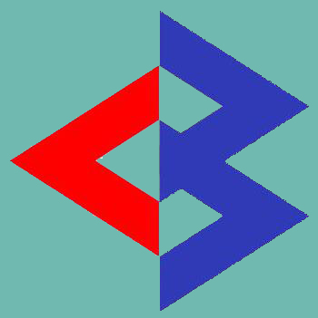
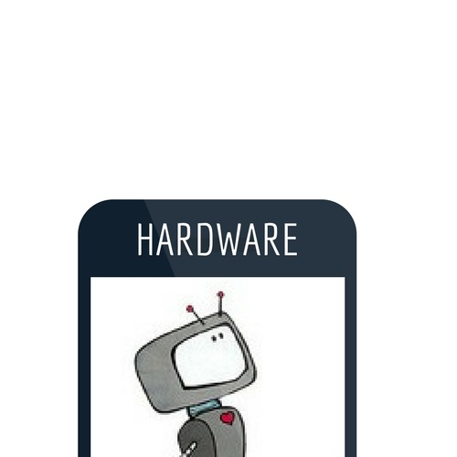
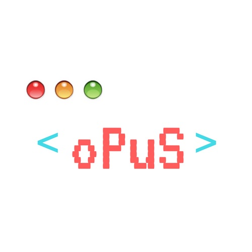

<html>
<head>
		<!-- BASICS -->
        <meta charset="utf-8">
		<meta http-equiv="X-UA-Compatible" content="IE=edge,chrome=1">
        <title>CyberBuzz</title>
        <meta name="description" content="">
		<meta name="viewport" content="width=device-width, initial-scale=1.0">
		<link rel="stylesheet" type="text/css" href="css/isotope.css" media="screen" />	
		<link rel="stylesheet" href="js/fancybox/jquery.fancybox.css" type="text/css" media="screen" />
		<link rel="stylesheet" href="css/bootstrap.css">
		<link rel="stylesheet" href="css/bootstrap-theme.css">
        <link rel="stylesheet" href="css/style.css">
		<!-- skin -->
		<link rel="stylesheet" href="skin/default.css">

</head>
	 
<body>
		<section id="header" class="appear"></section>
		

			 

				

					<button type="button" class="navbar-toggle" data-toggle="collapse" data-target=".navbar-collapse">
						
					</button>
					<h1><a class="navbar-brand" href="index.html" data-300="line-height:50px;">Home
					</a></h1>
				

				

					<ul class="nav navbar-nav" data-0="margin-top:20px;" data-300="margin-top:5px;">
						<li></li>
						<li><a href="#section-about">The Team</a></li>
						<li><a href="#section-works">Events</a></li>
						<li><a href="#section-contact">Contact</a></li>
					</ul>
				
<!--/.navbar-collapse -->
			

		

		<section class="featured">
			

 -					

 -						

 -							<figure class="member-photo"></figure>
 -							<h2 class="slogan">CyberBuzz XIV</h2>
 -							

 -							The Buzz is on.
 -							May 1, 2016				
 -							

							
						
								
						

					

				
			

		</section>
		
		<!-- services -->
		<section id="section-services" class="section pad-bot30 bg-white">
		
 
		
			

				

					

						<i class="fa fa-code fa-5x mar-bot20"></i>
						<h4 class="text-bold">About</h4>
						
CyberBuzz is the annual tech symposium held at Amity International School, Sector 43, Gurgaon.
						

					

				

					
				

					

						<i class="fa fa-terminal fa-5x mar-bot20"></i>
						<h4 class="text-bold">Specifications</h4>
						
With 13 events CyberBuzz XIV will truly test the tech quotient of the participants.
						

					

				

			
				

					

						<i class="fa fa-bolt fa-5x mar-bot20"></i>
						<h4 class="text-bold">Bugs</h4>
						
Error 404
						

					

				

			
			
	

		

		</section>
			
		<!-- spacer section:testimonial -->
		<section id="testimonials" class="section" data-stellar-background-ratio="0.5">
		

			
				
					

							

        						

        							<h5>
        								Test Quote 1
        							</h5>
        							 
        							&mdash; Devansh Arora
        						

							

					

				
			
	
		
	
		</section>
			
		<!-- about -->
		<section id="section-about" class="section appear clearfix">
		

				

					

						

							<h2 class="section-heading animated" data-animation="bounceInUp">The Team</h2>
							
Something about CyberBuzz Team

						

					

				

					

						

							

								<figure class="member-photo"></figure>
								

									<h4>Devansh Arora</h4>
									<h6>Cyber Captain</h6>
									Rev-Amp
								

							

						

						

							

								<figure class="member-photo"></figure>
								

									<h4>Piyush Kumar</h4>
									<h6>Deputy Cyber Captain</h6>
									Logic Gate
								

							

						

						

							

								<figure class="member-photo"></figure>
								

									<h4>Kshitijaa Jaglan</h4>
									Opus
								

							

						

						

							

								<figure class="member-photo"></figure>
								

									<h4>Shagun Agarwal</h4>
									Hardware
								

							

						

					
				
					

						

							

								<figure class="member-photo"></figure>
								

									<h4>Saksham Manaktala</h4>
									BUZZ-er
								

							

						

						

							

								<figure class="member-photo"></figure>
								

									<h4>Ankur Banga</h4>
									Logic Gate
								

							

						

						

							

								<figure class="member-photo"></figure>
								

								<h4>Anne Maria Sunil</h4>
									Opus
								

							

						

						

							

								<figure class="member-photo"></figure>
								

								<h4>Mehul Kumar</h4>
									Group Discussion Head
								

							

						

					

					
					

						

							

								<figure class="member-photo"></figure>
								

									<h4>Pernicka Prabhakar</h4>
									C1ue3 Head
								

							

						

						

							

								<figure class="member-photo"></figure>
								

									<h4>Chirag Vijay</h4>
									Pla(y)gue Head
								

							

						

						

							

								<figure class="member-photo"></figure>
								

								<h4>Rohan Yadav</h4>
									Group Discussion Head
								

							

						

						

							

								<figure class="member-photo"></figure>
								

								<h4>Piyush Prasad</h4>
									Blitzkrieg Head
								

							

						

					

						
		

		</section>
		<!-- /about -->
		
		<!-- spacer section:stats -->
		<section id="parallax1" class="section pad-top40 pad-bot40" data-stellar-background-ratio="0.5">
			

            

                <blockquote class="bigquote color-white">Something Something</blockquote>
				
Something More

            

			
	
		</section>
		
		<!-- section works -->
		<section id="section-works" class="section appear clearfix">
			

				
				

					

						

							<h2 class="section-heading animated" data-animation="bounceInUp">Events</h2>
							
13 tech packed events!

						

					

				

					
                        

                          <nav id="filter" class="col-md-12 text-center">
                            <ul>
                              <li><a href="#" class="current btn-theme btn-small" data-filter="*">All</a></li>
                            </ul>
                          </nav>
                          

                            

                              

							  
                                <article class="col-md-4 isotopeItem webdesign">
									

										
										 

											

												<h5><a href="#">Logic Gate</a></h5>
												
Programming Event. Written prelims which test the logical knowledge followed by a long coding session involving various questions.
												

											 
										   
										 

									

                                </article>

                                <article class="col-md-4 isotopeItem photography">
									

										
										 

											

												<h5><a href="#">Blitzkrieg</a></h5>
												
Game Development. Develop a game that is visually stunning which gives a full-fat gaming experience and has a lasting impact on the player. Showcase your creativity.
												

											
											 
										   
										 

									

                                </article>
								

                                <article class="col-md-4 isotopeItem photography">
									

										
										 

											

												<h5><a href="#">BUZZ-er</a></h5>
												
Open Quiz. Prelims followed by 6 teams in the finals. 

												
											 
										   
										 

									

                                </article>

                                <article class="col-md-4 isotopeItem print">
									

										
										 

											

												<h5><a href="#">C1ue3</a></h5>
												
 Surprise Event. Basics and logic is all we need to survive in life. Or in this event. Try us, we may surprise you.

											
												
												
											 
										   
										 

									

                                </article>

                                <article class="col-md-4 isotopeItem photography">
									

										
										 

											

												<h5><a href="#">Chalchitra</a></h5>
												
 Video Making. 

												
											 
										   
										 

									

                                </article>

                                <article class="col-md-4 isotopeItem webdesign">
									

										
										 

											

												<h5><a href="#">Clic(k)he</a></h5>
												
Photography

												
											 
										   
										 

									

                                </article>

                                <article class="col-md-4 isotopeItem print">
									

										
										 

											

												<h5><a href="#">Hardware</a></h5>
												
Hardware.

												
											 
										   
										 

									

                                </article>

                                <article class="col-md-4 isotopeItem photography">
									

										
										 

											

												<h5><a href="#">Opus</a></h5>
												
 Web Devlopment.

												
											 
										   
										 

									

                                </article>

                                <article class="col-md-4 isotopeItem print">
									

										
										 

											

												<h5><a href="#">Pla(y)gue</a></h5>
												
Gaming

												
											 
										   
										 

									

                                </article>
								
								<article class="col-md-4 isotopeItem webdesign">
									

										
										 

											

												<h5><a href="#">Rev-Amp</a></h5>
												
Audio Mixing
												

											 
										   
										 

									

                                </article>
								
								<article class="col-md-4 isotopeItem webdesign">
									

										
										 

											

												<h5><a href="#">Trial by Combat</a></h5>
												
Group Discussion.
												

											 
										   
										 

									

                                </article>
								
								<article class="col-md-4 isotopeItem webdesign">
									

										
										 

											

												<h5><a href="#">X-Word</a></h5>
												
Crossword
												

											 
										   
										 

									

                                </article>
								
								<article class="col-md-4 isotopeItem webdesign">
									

										
										 

											

												<h5><a href="#">Lil Evolutioners</a></h5>
												
Story Book Weaver.
												

											 
										   
										 

									

                                </article>
								
								<article class="col-md-4 isotopeItem webdesign">
									

										
										 

											

												<h5><a href="#">PreziPitate</a></h5>
												
Junior Presentation

												
											 
										   
										 

									

                                </article>
								
                                

                                        
							
							
                        

				
				

			

		</section>
		<section id="parallax2" class="section parallax" data-stellar-background-ratio="0.5">	
            

                <blockquote class="bigquote color-white">Yes.</blockquote>
				
Again, Something More

            

		</section>

		<!-- contact -->
		<section id="section-contact" class="section appear clearfix">
			

				
				

					

						

							<h2 class="section-heading animated" data-animation="bounceInUp">Contact us</h2>
							
Email us at : amitycyberbuzz@gmail.com 

						

					

				
							
			

		</section>		
	<section id="footer" class="section footer">
		

			

				

                    <ul class="social-network social-circle">
                        <li><a href="#" class="icoFacebook" title="Facebook"><i class="fa fa-facebook"></i></a></li>
                    </ul>				
				

			

			

					

Copyright &copy; CyberBuzz

                        

                            <!-- 
                                All the links in the footer should remain intact. 
                                You can delete the links only if you purchased the pro version.
                                Licensing information: https://bootstrapmade.com/license/
                                Purchase the pro version with working PHP/AJAX contact form: https://bootstrapmade.com/buy/?theme=Amoeba
                            -->
                        

                    

			

		

	</section>
	<a href="#header" class="scrollup"><i class="fa fa-chevron-up"></i></a>	

	
	
	
    
	
	
	
	
			
	
	
	
	
    
    
    
</body>
</html>
